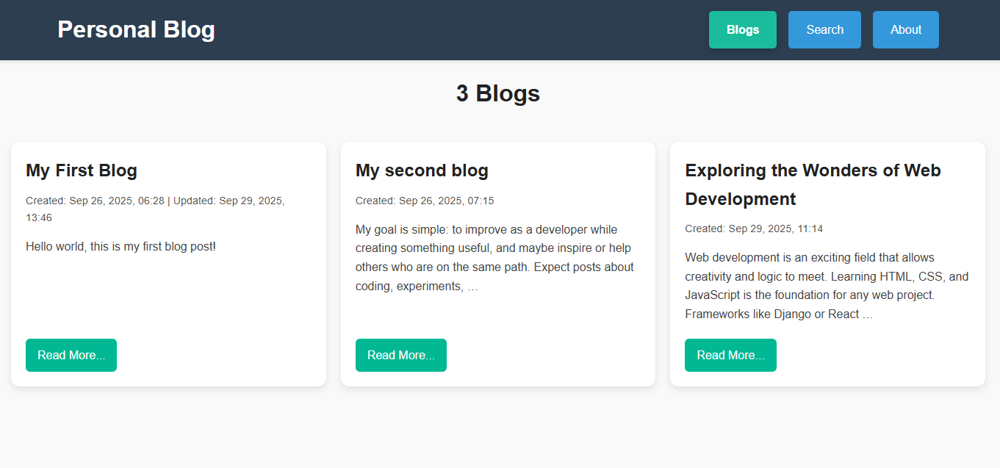

# Personal Blog - Django Project

A simple yet functional personal blog built with Django.  
Users can browse blog posts, and admins can create, edit, and manage posts.  
This project was developed step by step as a learning journey into Django and full-stack development.

---

## 🚀 Inspiration

This project idea comes from roadmap.sh, a great resource for developers.  
- Main site: https://roadmap.sh  
- Project idea: https://roadmap.sh/projects/personal-blog  

---

## 🛠️ Tech Stack

- Python (3.10+ recommended)  
- Django (5.x)  
- SQLite (default Django database)  
- HTML, CSS (Django templates)  

---

## 📦 Requirements

This project uses the following dependencies:
```
Django>=5.0,<6.0  
```
To install all dependencies:
```
pip install -r requirements.txt  
```
---

## ⚙️ Installation & Setup

Follow these steps to run the project locally:

1. Clone the repository:
   ```
   git clone https://github.com/Arshiya-Bagheri/personal-blog.git  
   cd config
   ```
3. Create a virtual environment (recommended):
   ``` 
   python -m venv venv  
   source venv/bin/activate   # Linux/Mac  
   venv\Scripts\activate      # Windows  
   ```
5. Install dependencies:
   ```
   pip install -r requirements.txt  
   ```
7. Run migrations:
   ```
   python manage.py migrate  
   ```
9. Create a superuser:
    ```
   python manage.py createsuperuser
    ```
   - Enter a username, email (optional), and password.  
   - This account lets you access the Django admin panel at /admin/.  

11. Run the development server:
   ```
   python manage.py runserver  
   ```
13. Open the app: 
   ```
   Visit http://127.0.0.1:8000/  
   ```
---

## 📖 Usage

- Browse blog posts on the homepage.  
- Click "Read more" to view full posts.  
- Login as an admin to:  
  - Add new blog posts  
  - Edit existing posts   

---

## 📂 Project Structure

Here’s a high-level view of the project:
```
personal-blog/  
|   └── config/ 
|       ├── config/ 
|       ├── blog/           # Blog app (models, views, templates)
|       └── manage.py             
├── README.md
└── requirements.txt  
```
---

## 🤝 Contributing

Contributions, issues, and feature requests are welcome!  
Feel free to fork this repo and submit a pull request.

---

## 📜 License

This project is licensed under the **GNU General Public License v3.0 (GPLv3)**.  
You are free to use, modify, and distribute this software, but any derivative work **must also be open-sourced under the GPLv3 license**.

See the [LICENSE](LICENSE) file for full details.


---

## 📸 Screenshots

- What users see 
  
  
  

- What admin sees 
  
  
  
  
  
